  

My name is Hussain Abbas, and I go by `hussainweb` online in most places. Over the past two decades, I have built and, more importantly, helped others build computer programs and scalable systems.

I work as a **Director of Engineering**, focusing heavily on Developer Experience (DevEx), Platform Engineering, DevOps, and exploring AI-native workflows. I contribute to open-source software out of my own interest and as part of my work. 

I have a [longer README](https://hussainweb.github.io/README/) if you are interested in more about my management and working style. You can also explore my [overall timeline](https://hussainweb.me/changelog), the [tools I use](https://hussainweb.me/uses/), and my writing on my [personal blog](https://hussainweb.me).

---

## Latest Blog Posts
<!-- BLOG-POST-LIST:START -->
- [How I Saved My Immich Installation from a Broken PostgreSQL Upgrade on TrueNAS](https://hussainweb.me/blog/truenas-immich-postgres-upgrade/)
- [Beyond &quot;It Works on My Machine&quot;: Lessons from Modernizing a Legacy Ansible Role](https://hussainweb.me/blog/modernizing-ansible-role-chezmoi/)
- [Self-Hosting Atuin with Docker and Coolify](https://hussainweb.me/blog/self-hosting-atuin-with-docker-and-coolify/)
- [Teaching Gemini My Voice: A Journey into Skill Creation](https://hussainweb.me/blog/teaching-gemini-my-voice-skill-creation/)
- [The Reboot: Ditching the Grand Architecture for Astro](https://hussainweb.me/blog/the-reboot-ditching-the-grand-architecture-for-astro/)
<!-- BLOG-POST-LIST:END -->

---

## Statistics

  
  

---

## Let's Connect

## Skills & Expertise

<table>
  <tr>
    <td valign="top" width="50%">

**🎯 Leadership & Strategy**
 

 

**☁️ Cloud & Infrastructure**
 

</td>
<td valign="top" width="50%">

**💻 Languages & Frameworks**
 

 

**🤖 AI & Agentic Workflows**
 

 

**🛠️ Other Tools**
 

</td>
</tr>
</table>

## Previously Worked With

---

  <a href="https://youtu.be/UqNbBe3lVCI">🎥 How did I build this profile?</a>

