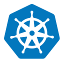

# hussainweb

My name is Hussain Abbas, and I go by `hussainweb` online in most places. Over the past two decades, I have built and, more importantly, helped others build computer programs and scalable systems.

I work as a **Director of Engineering**, focusing heavily on Developer Experience (DevEx), Platform Engineering, DevOps, and exploring AI-native workflows. I contribute to open-source software out of my own interest and as part of my work. 

I have a [longer README](https://hussainweb.github.io/README/) if you are interested in more about my management and working style. You can also explore my [overall timeline](https://hussainweb.me/changelog), the [tools I use](https://hussainweb.me/uses/), and my writing on my [personal blog](https://hussainweb.me).

---

**Connect with me:**

**Currently working with:**

 
<em>Plus more in the DevEx, Platform Engineering, and DevOps space.</em>

**Learning:**

 
<em>Currently exploring AI, Machine Learning, and related technologies.</em>

**Previously worked with:**

**Currently focused on:**

- Exploring and learning AI native tools and ways of working

[How did I build this?](https://youtu.be/UqNbBe3lVCI)
